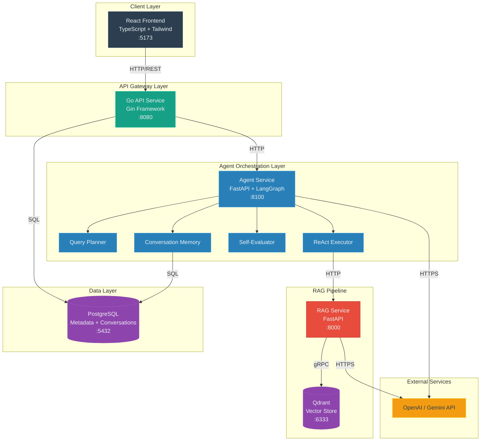
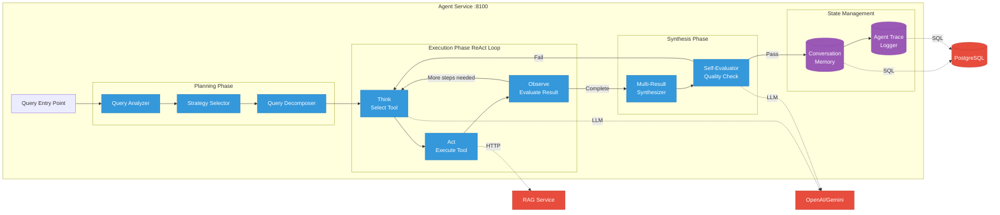
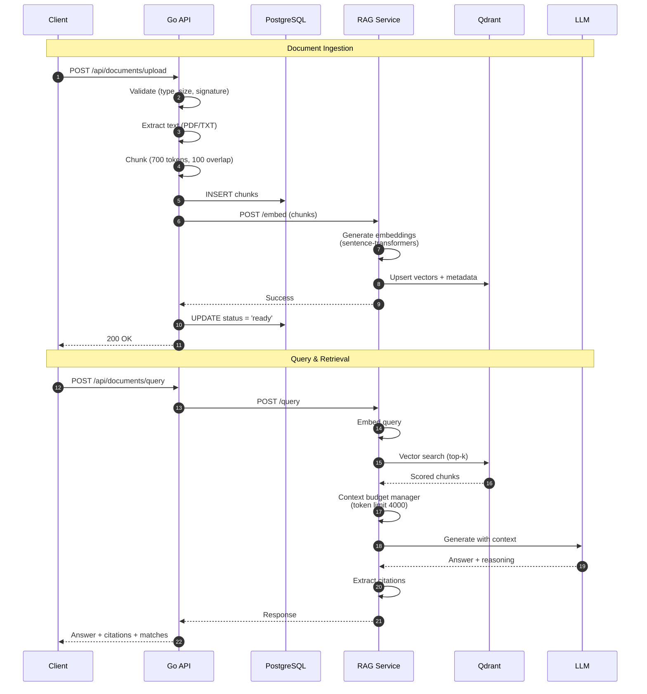

# DocSense

Production-grade document intelligence platform powered by Retrieval-Augmented Generation (RAG) and Agentic AI orchestration.

## What This Project Is

A reference implementation of an intelligent document management system that combines RAG with an Agentic AI layer for multi-step reasoning, query planning, and self-evaluation. Built to demonstrate production patterns: explicit service boundaries, structured data flow, persistent conversation memory, and engineering trade-offs documented in code.

This is not a demo. This is how AI-powered document systems are built when clarity, reliability, and maintainability matter.

## What This Project Is Not

- A chatbot template
- A minimal viable product
- Production-ready without modifications
- An all-in-one framework

## System Architecture



## Core Components

| Service | Stack | Port | Responsibility |
|---------|-------|------|----------------|
| **Go API** | Go 1.24, Gin | 8080 | HTTP gateway, document lifecycle, request routing |
| **Agent Service** | Python 3.12, FastAPI, LangGraph | 8100 | Query planning, multi-step reasoning, tool orchestration, memory |
| **RAG Service** | Python 3.12, FastAPI | 8000 | Embedding generation, vector retrieval, LLM generation |
| **PostgreSQL** | v16 | 5432 | Relational data: users, documents, conversations, agent traces |
| **Qdrant** | v1.12 | 6333 | Vector similarity search with payload filtering |
| **Frontend** | React, TypeScript, Tailwind | 5173 | Document upload, query interface, agent trace visualization |

## Agentic AI Architecture

The Agent Service is the orchestration brain of DocSense—a ReAct-style autonomous agent that reasons, plans, executes tools, and self-evaluates before returning answers.

### Agent Internal Architecture



### Agent Execution Flow

```mermaid
sequenceDiagram
    autonumber
    participant U as User
    participant API as Go API
    participant AG as Agent Service
    participant RAG as RAG Service
    participant LLM as LLM
    participant DB as PostgreSQL

    U->>API: POST /api/documents/query<br/>{query, session_id}
    API->>AG: POST /agent/query
    
    rect rgb(52, 152, 219)
    Note over AG: Phase 1: Planning
    AG->>AG: Analyze query complexity<br/>(heuristics + patterns)
    alt Complex query
        AG->>LLM: Generate execution plan
        LLM-->>AG: Strategy + decomposed steps
    else Simple query
        AG->>AG: Use direct retrieval
    end
    AG->>DB: INSERT agent_action<br/>(type='plan')
    end
    
    rect rgb(46, 204, 113)
    Note over AG: Phase 2: Tool Execution (ReAct Loop)
    loop For each step (max 8 iterations)
        AG->>AG: THINK: Select next tool<br/>(search|compare|summarize|extract)
        AG->>DB: INSERT agent_action<br/>(type='tool_selection')
        
        AG->>RAG: ACT: Execute tool<br/>POST /query or /embed
        RAG->>RAG: Embed → Vector Search → Generate
        RAG-->>AG: {answer, citations, chunks}
        AG->>DB: INSERT agent_action<br/>(type='tool_execution')
        
        AG->>AG: OBSERVE: Evaluate result<br/>(sufficient? need more context?)
        AG->>DB: INSERT agent_action<br/>(type='observation')
        
        alt Insufficient information
            AG->>AG: Refine query or try different tool
        else Information complete
            AG->>AG: Exit loop
        end
    end
    end
    
    rect rgb(155, 89, 182)
    Note over AG: Phase 3: Synthesis
    alt Multiple results
        AG->>LLM: Synthesize coherent answer<br/>from all tool results
        LLM-->>AG: Unified answer
    else Single result
        AG->>AG: Use direct result
    end
    AG->>DB: INSERT agent_action<br/>(type='synthesis')
    end
    
    rect rgb(241, 196, 15)
    Note over AG: Phase 4: Self-Evaluation
    AG->>AG: Check groundedness<br/>(citations present?)
    AG->>AG: Check completeness<br/>(all sub-queries answered?)
    alt High quality
        AG->>LLM: Verify coherence
        LLM-->>AG: Quality score + feedback
        AG->>DB: INSERT agent_action<br/>(type='evaluation', quality='high')
    else Low quality
        AG->>DB: INSERT agent_action<br/>(type='evaluation', quality='low')
        AG->>AG: Retry with different strategy<br/>(if retries remaining)
    end
    end
    
    rect rgb(52, 73, 94)
    Note over AG,DB: Phase 5: Persistence & Response
    AG->>DB: INSERT message<br/>(role='user', content=query)
    AG->>DB: INSERT message<br/>(role='assistant', content=answer, citations)
    AG->>AG: Generate follow-up suggestions<br/>(based on document context)
    AG->>DB: UPDATE conversation<br/>(status='active')
    end
    
    AG-->>API: {answer, citations, suggestions,<br/>strategy, trace, quality_score}
    API-->>U: Enriched response with<br/>full audit trail
```



### Agent Capabilities

| Capability | Description |
|-----------|-------------|
| **Query Planning** | Analyzes query complexity and selects optimal strategy (direct, decompose, compare, summarize, extract) |
| **Query Decomposition** | Breaks complex multi-part questions into focused sub-queries with dependency graphs |
| **Tool Execution** | Dispatches to specialized tools: search, compare, summarize, extract |
| **Multi-hop Retrieval** | Chains retrievals where later queries depend on earlier results |
| **Conversation Memory** | PostgreSQL-backed persistent sessions with sliding window context |
| **Self-Evaluation** | Assesses answer groundedness, completeness, and coherence before returning |
| **Retrieval Strategy Selection** | Dynamically selects retrieval mode (semantic, hybrid, exhaustive) based on query characteristics |
| **Agent Trace Logging** | Full audit trail of every reasoning step stored in PostgreSQL |
| **Graceful Degradation** | Falls back to direct RAG if agent service is unavailable |
| **Follow-up Suggestions** | Generates contextual suggestions for continued exploration |

### Technology Decisions

**LangGraph over raw LangChain chains**: LangGraph provides a proper state machine for the ReAct loop with explicit state transitions, retry logic, and conditional branching. Raw chains are too rigid for production agent patterns.

**PostgreSQL for memory (not Redis)**: Conversations and agent traces are durable audit data, not ephemeral cache. PostgreSQL provides ACID guarantees, queryable history, and avoids adding another infrastructure dependency.

**Agent as separate service (not embedded in RAG)**: Separation of concerns. RAG stays a pure retrieval/generation service. Agent handles orchestration logic. Either can be scaled, replaced, or disabled independently.

**Graceful degradation pattern**: When the agent service is down, the API falls back to direct RAG queries. Users get answers (without agent reasoning) rather than errors.

## RAG Pipeline Flow



## Project Structure

```
DocSense/
├── apps/
│   └── web/                    # React frontend (TypeScript + Tailwind)
│
├── services/
│   ├── api/                    # Go API gateway (Gin, clean architecture)
│   ├── rag/                    # Python RAG service (FastAPI, sentence-transformers)
│   └── agent/                  # Python Agent service (FastAPI, LangGraph)
│       ├── app/
│       │   ├── main.py
│       │   ├── agent/
│       │   │   ├── planner.py     # Query analysis & strategy selection
│       │   │   ├── executor.py    # ReAct reasoning loop
│       │   │   ├── tools.py       # Tool registry (search, compare, summarize, extract)
│       │   │   ├── evaluator.py   # Self-evaluation & quality verification
│       │   │   ├── memory.py      # PostgreSQL-backed conversation persistence
│       │   │   └── router.py      # LLM provider abstraction
│       │   ├── strategies/
│       │   │   ├── retrieval.py   # Retrieval mode selection
│       │   │   ├── decomposition.py # Query decomposition
│       │   │   └── synthesis.py   # Multi-source answer synthesis
│       │   ├── api/
│       │   │   ├── routes.py      # HTTP endpoints
│       │   │   └── schemas.py     # Request/response models
│       │   └── core/
│       │       ├── config.py      # Environment-based configuration
│       │       ├── logging.py     # Structured logging (structlog)
│       │       └── database.py    # Async SQLAlchemy connection pool
│       ├── requirements.txt
│       └── Dockerfile
│
├── packages/
│   └── shared/                 # Shared constants and type definitions
│
├── infra/
│   ├── compose/env/            # Per-service environment files
│   └── postgres/               # Database schema + migrations
│
├── docs/
│   ├── architecture/           # Architecture docs & roadmap
│   ├── deployment/             # Deployment checklists & guides
│   └── guides/                 # User & developer guides
│
├── .github/                    # CI/CD workflows
├── docker-compose.yml          # Service orchestration
├── Makefile                    # Developer commands
├── .env.example                # Full config reference
└── README.md
```

## Database Schema

### Core Tables (Existing)
- `users` — Application identities
- `documents` — Upload metadata
- `document_contents` — Extracted full text
- `document_chunks` — Text segments linked to Qdrant vectors

### Agent Tables (New)
- `conversations` — Persistent chat sessions with user scoping
- `messages` — Individual turns (user/assistant) with citation tracking
- `agent_actions` — Full trace log of every agent reasoning step
- `document_metadata` — AI-enriched document intelligence (summaries, topics, entities)
- `query_analytics` — Strategy selection and quality metrics for continuous improvement

## Key Design Decisions

### Polyglot Services

**Decision:** Go for API gateway, Python for ML workloads and agent reasoning.

**Rationale:**
- Go: Fast HTTP handling, single-binary deployment, strong concurrency
- Python: First-class ML ecosystem, LangGraph/LangChain native support, sentence-transformers

**Trade-off:** Network hop overhead vs. language-appropriate tooling.

### Agent as Orchestration Layer

**Decision:** Dedicated agent service between API and RAG.

**Rationale:**
- RAG remains a pure retrieval primitive — easy to test and optimize independently
- Agent handles orchestration complexity (planning, tool dispatch, memory, evaluation)
- Each service scales independently based on load profile
- Agent can be disabled (`AGENT_ENABLED=false`) for direct RAG access

**Trade-off:** Additional network hop and service complexity vs. clear separation of concerns and independent scalability.

### ReAct Pattern for Reasoning

**Decision:** ReAct-style (Reason + Act) loop over static chains.

**Rationale:**
- Supports dynamic tool selection based on intermediate results
- Natural self-correction when early steps produce insufficient information
- Bounded by `MAX_REASONING_STEPS` to prevent runaway loops
- Each step is logged for full observability

**Trade-off:** Higher latency per query vs. significantly better answer quality for complex questions.

### Embedding Model

**Choice:** `sentence-transformers/all-MiniLM-L6-v2`

- 384 dimensions
- CPU-friendly inference (~50-200ms/chunk)
- Good general-purpose semantic similarity

### Vector Store

**Choice:** Qdrant (self-hosted)

- No vendor lock-in
- Payload storage with vectors
- Filtering support for multi-tenancy

### LLM Provider

**Choice:** OpenAI-compatible API (abstracted). Supports OpenAI, Gemini, or any OpenAI-compatible endpoint (Ollama, vLLM).

## Security & Trust Boundaries

### Implemented Protections

- File validation: PDF signature verification, extension checks, size limits
- Input sanitization: Query validation, prompt injection detection
- Path traversal prevention: Filename sanitization
- SQL injection prevention: Parameterized queries only
- User isolation: Document scoping by user ID

### Production Gaps

- **Authentication:** Dev middleware only. Implement JWT/OAuth.
- **Rate limiting:** None. Add at gateway.
- **Service auth:** Internal services unauthenticated. Add mTLS or API keys.
- **Secrets management:** Environment files. Use HashiCorp Vault or cloud KMS.

## Quick Start

```bash
# 1. Clone and configure
cd DocSense
cp infra/compose/env/api.env.example infra/compose/env/api.env
cp infra/compose/env/rag.env.example infra/compose/env/rag.env
cp infra/compose/env/agent.env.example infra/compose/env/agent.env
cp infra/compose/env/postgres.env.example infra/compose/env/postgres.env
cp infra/compose/env/qdrant.env.example infra/compose/env/qdrant.env
cp infra/compose/env/web.env.example infra/compose/env/web.env

# 2. Set your API keys in the env files
# Edit infra/compose/env/agent.env → set OPENAI_API_KEY
# Edit infra/compose/env/rag.env → set OPENAI_API_KEY

# 3. Start all services
cd infra/compose
docker compose up --build -d

# 4. Verify
curl http://localhost:8080/health      # API gateway
curl http://localhost:8000/health      # RAG service
curl http://localhost:8100/agent/health # Agent service
```

## API Endpoints

### Document Management (Go API :8080)
| Method | Endpoint | Description |
|--------|----------|-------------|
| `POST` | `/api/documents/upload` | Upload PDF/TXT document |
| `GET` | `/api/documents` | List user's documents |
| `POST` | `/api/documents/query` | Query documents (routed through Agent) |
| `DELETE` | `/api/documents/:id` | Delete document |

### Agent Service (:8100)
| Method | Endpoint | Description |
|--------|----------|-------------|
| `POST` | `/agent/query` | Agentic query with planning + reasoning |
| `GET` | `/agent/conversations/:session_id` | Get conversation summary |
| `DELETE` | `/agent/conversations/:session_id` | Delete conversation |
| `GET` | `/agent/conversations/:session_id/actions` | Get agent action log |
| `GET` | `/agent/health` | Health check with dependency status |

### RAG Service (:8000)
| Method | Endpoint | Description |
|--------|----------|-------------|
| `POST` | `/embed` | Embed document chunks |
| `POST` | `/query` | Direct RAG query |
| `DELETE` | `/documents/:id/vectors` | Delete document vectors |
| `GET` | `/health` | Health check |

## Testing

### Run Agent Service Tests

```bash
make test-agent
```

Or with coverage:

```bash
make test-agent-cov
```

### Run End-to-End Tests

Requires services running:

```bash
docker compose up -d
sleep 20
make test-e2e
```

### Test Coverage

- **Unit Tests**: Planner, Executor, Tools, Evaluator
- **Integration Tests**: Full orchestration flow
- **E2E Tests**: Real service communication

See [docs/guides/TESTING.md](./docs/guides/TESTING.md) for detailed testing guide.

## Makefile Commands

| Command | Description |
|---------|-------------|
| `make up` | Start all services |
| `make down` | Stop all services |
| `make logs` | Tail combined logs |
| `make health` | Health check all services |
| `make test-agent` | Run agent service tests |
| `make test-e2e` | Run end-to-end validation |
| `make clean` | Remove all containers & volumes |

## Deployment Validation

After deployment, validate the stack:

1. **Health Checks**:
   ```bash
   curl http://localhost:8080/health
   curl http://localhost:8000/health
   curl http://localhost:8100/agent/health
   ```

2. **Test Agent Query**:
   ```bash
   curl -X POST http://localhost:8100/agent/query \
     -H "Content-Type: application/json" \
     -d '{
       "query": "What is artificial intelligence?",
       "user_id": "test_user",
       "session_id": "test_session",
       "enable_planning": true,
       "enable_evaluation": true,
       "include_trace": true
     }'
   ```

3. **Run E2E Test Suite**:
   ```bash
   python scripts/test_e2e.py
   ```

Expected output:
- ✓ Services Health
- ✓ Simple Query
- ✓ Complex Query  
- ✓ Conversation Persistence
- ✓ Agent Trace Logging

## Additional Documentation

- [docs/deployment/DEPLOYMENT_CHECKLIST.md](./docs/deployment/DEPLOYMENT_CHECKLIST.md)
- [docs/architecture/IMPLEMENTATION_SUMMARY.md](./docs/architecture/IMPLEMENTATION_SUMMARY.md)
- [docs/architecture/ARCHITECTURE.md](./docs/architecture/ARCHITECTURE.md)
- [docs/guides/TESTING.md](./docs/guides/TESTING.md)
