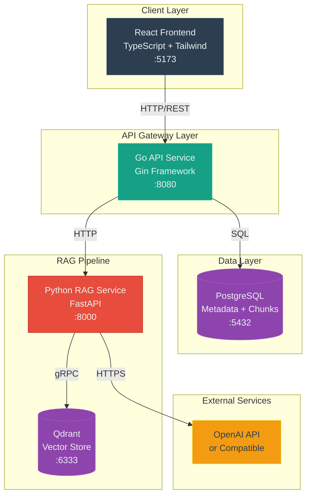
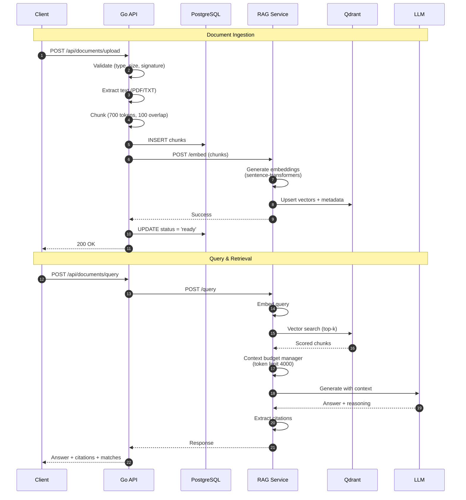
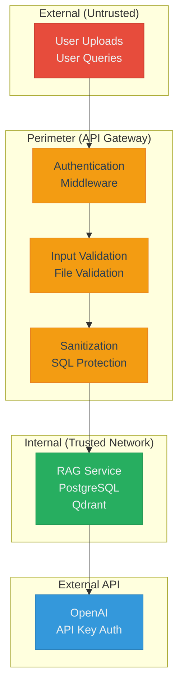

# DocSense

Production-grade RAG system for document intelligence using polyglot services.

## What This Project Is

A reference implementation of Retrieval-Augmented Generation with clear separation between ingestion, retrieval, and generation. Built to demonstrate production patterns: explicit service boundaries, structured data flow, and engineering trade-offs documented in code.

This is not a demo. This is how RAG systems are built when clarity and maintainability matter.

## What This Project Is Not

- A chatbot template
- A minimal viable product
- Production-ready without modifications
- An all-in-one framework

## System Architecture



## Core Components

| Service | Stack | Responsibility |
|---------|-------|----------------|
| **Go API** | Go 1.24, Gin | HTTP gateway, document lifecycle, orchestration |
| **RAG Service** | Python 3.11, FastAPI | Embedding generation, vector retrieval, LLM calls |
| **PostgreSQL** | v16 | Relational data: users, documents, chunks, metadata |
| **Qdrant** | v1.12 | Vector similarity search with payload filtering |
| **Frontend** | React, TypeScript | Document upload, query interface |

## RAG Pipeline Flow



## Key Design Decisions

### Polyglot Services

**Decision:** Go for API gateway, Python for ML workloads.

**Rationale:**
- Go: Fast HTTP handling, single-binary deployment, strong concurrency
- Python: First-class ML ecosystem, sentence-transformers native support

**Trade-off:** Network hop overhead vs. language-appropriate tooling.

### Embedding Model

**Choice:** `sentence-transformers/all-MiniLM-L6-v2`

- 384 dimensions
- CPU-friendly inference (~50-200ms/chunk)
- Good general-purpose semantic similarity

**Trade-off:** Larger models (mpnet-base) improve quality but require GPU.

### Chunking Strategy

**Choice:** Fixed-size chunks (700 tokens, 100-token overlap)

**Rationale:**
- Deterministic and reproducible
- Document-format agnostic
- Overlap preserves context at boundaries

**Trade-off:** Semantic chunking preserves meaning better but adds complexity.

### Vector Store

**Choice:** Qdrant

- Self-hosted, no vendor lock-in
- Payload storage with vectors
- Filtering support for multi-tenancy

**Trade-off:** Operational burden vs. control and cost.

### Synchronous Ingestion

**Decision:** Upload blocks until embedding completes.

**Rationale:** Simpler debugging, clearer data flow for learning.

**Trade-off:** Latency vs. complexity. Production systems use async queues.

### LLM Provider

**Choice:** OpenAI-compatible API (abstracted)

The `OPENAI_BASE_URL` can point to OpenAI, Azure OpenAI, local Ollama, vLLM, or any compatible endpoint.

**Trade-off:** External API dependency vs. self-hosted control and latency.

## Security & Trust Boundaries



### Implemented Protections

- File validation: PDF signature verification, extension checks, size limits
- Input sanitization: Query validation, basic prompt injection detection
- Path traversal prevention: Filename sanitization
- SQL injection prevention: Parameterized queries only
- User isolation: Document scoping by user ID

### Production Gaps

- **Authentication:** Dev middleware only. Implement JWT/OAuth.
- **Rate limiting:** None. Add at gateway.
- **Service auth:** Internal services unauthenticated. Add mTLS or API keys.
- **Secrets management:** Environment files. Use HashiCorp Vault or cloud KMS.

## Planned Enhancements

- Two-stage retrieval with reranking
- Async embedding pipeline with message queue
- Semantic chunking for structured documents
- Multi-document cross-referencing
- Fine-tuned embedding models for domain-specific corpora

## Project Structure

```
DocSense/
├── apps/web/                # React frontend
├── services/
│   ├── api/                 # Go API gateway (clean architecture)
│   └── rag/                 # Python RAG service
├── infra/
│   ├── compose/             # Docker Compose
│   └── postgres/            # Database schema
└── docs/                    # Architecture documentation
```

## Additional Documentation

- [DEPLOYMENT_CHECKLIST.md](./DEPLOYMENT_CHECKLIST.md)
- [IMPLEMENTATION_SUMMARY.md](./IMPLEMENTATION_SUMMARY.md)
- [docs/ARCHITECTURE.md](./docs/ARCHITECTURE.md)
